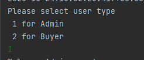
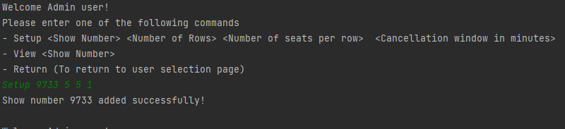
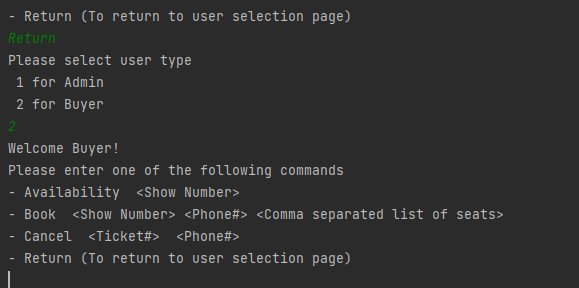
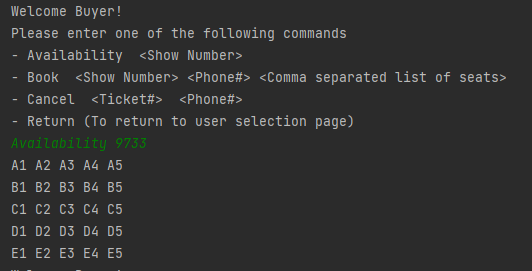
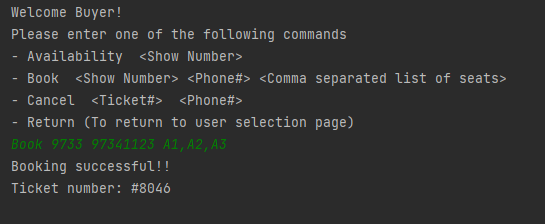
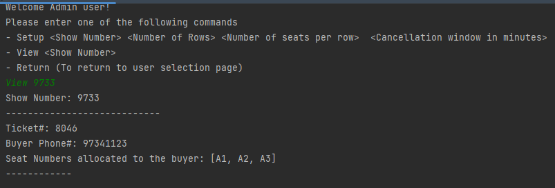
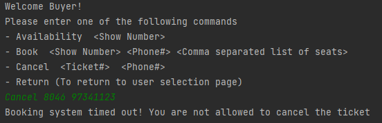
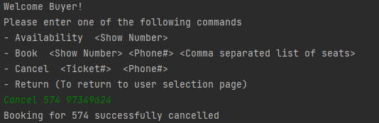

# ShowBooking

# About this application
This is a simple Springboot CLI application that allows admin to setup shows and buyers to make bookings.

## Assumptions made
1. User would have to enter command "1"(Admin) or "2"(Buyer) to select user type
2. Admin has no access to Buyer commands.
3. Buyer has no access to Admin commands.
4. Buyer cannot book seats that are already occupied
5. Buyer cannot book seats that don't exist
6. Buyer cannot make bookings for shows that doesn't exist
7. Ticket number must be unique

## Sample commands:
**User**
1. Admin page: `1`
2. Buyer page: `2`

**Admin**
1. Setup shows: `Setup 9733 5 5 1`
2. View shows and bookings: `View 9733`

**Buyer**
1. View available seats for a shows: `Availability 9733`
2. Book seats for a show: `Book 9733 97349624 A1,A2,A3`
3. Cancel booking for a show: `Cancel 1234 97349624`

## How to use this application

1. Run `ShowBookingApplication`
2. Interact with the CLI with your command inputs

Admin

1. Enter "1" to access Admin page

2. Enter "Setup 9733 5 5 1"  to setup show

3. Return to User selection screen with "Return" command and enter "2" to access Buyer page

4. Enter "Availability 9733" to check the availability

5. Enter "Book 9733 97341123 A1,A2,A3" to book seats for the show

6. Return to Admin page and enter "View 9733" to view the booking details for the show

7. Return to Buyer page and enter "Cancel 8046 97341123" to cancel booking (Unable to cancel due to timeout usecase)

8. Return to Buyer page and enter "Cancel 574 97349624" to cancel booking (Successful cancellation use case)
